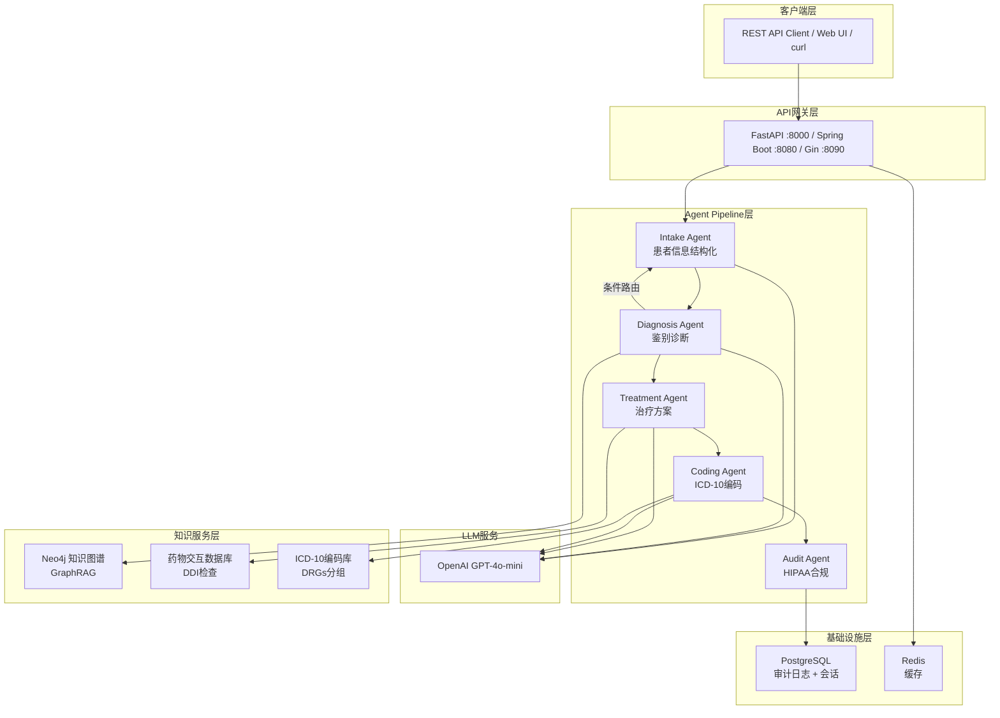

# 02 — 架构设计详解

## 目录

- [1. 整体架构图](#1-整体架构图)
- [2. 分层架构说明](#2-分层架构说明)
- [3. Pipeline模式 vs 其他Agent编排模式](#3-pipeline模式-vs-其他agent编排模式)
- [4. LangGraph核心概念](#4-langgraph核心概念)
- [5. 共享状态ClinicalState设计](#5-共享状态clinicalstate设计)
- [6. 三种语言的Pipeline实现对比](#6-三种语言的pipeline实现对比)
- [7. 数据流图：从raw_input到最终输出](#7-数据流图从raw_input到最终输出)
- [8. 错误处理和重试机制](#8-错误处理和重试机制)
- [9. 扩展点与演进方向](#9-扩展点与演进方向)

---

## 1. 整体架构图

以下是系统的架构全景图（Mermaid图表语法）：



> **小白解读**：这张图展示了整个系统的"全家福"。用户从最上面发送请求，经过API层进入Agent Pipeline，5个Agent依次执行。每个Agent可能调用LLM或外部知识服务，最终结果存储到数据库并返回给用户。

---

## 2. 分层架构说明

系统采用经典的分层架构设计，每一层有明确的职责边界：

### 2.1 四层架构

| 层 | 职责 | 对应代码目录 | 核心组件 |
|----|------|------------|---------|
| **API层** | 接收HTTP请求，路由分发，响应返回 | `src/api/` | FastAPI routes、Spring Controller、Gin Handler |
| **Agent Pipeline层** | 编排5个Agent的执行顺序和条件路由 | `src/graph/` + `src/agents/` | StateGraph、ClinicalState、5个Agent函数 |
| **服务层** | 提供可复用的业务能力（编码、检索、合规） | `src/services/` | ICD10Service、DDI、GraphRAG、HIPAA、FHIR |
| **基础设施层** | 数据存储、缓存、外部API通信 | Docker服务 | PostgreSQL、Neo4j、Redis、OpenAI API |

### 2.2 层间依赖规则

```
API层 ──调用──→ Agent Pipeline层
Agent Pipeline层 ──调用──→ 服务层
Agent Pipeline层 ──调用──→ LLM（OpenAI API）
服务层 ──调用──→ 基础设施层（数据库、外部API）
```

**关键原则**：
- **上层可以调用下层**，反过来不行（严格的单向依赖）
- Agent不直接操作数据库，而是通过服务层
- 服务层的方法可以独立测试，不依赖LLM

> **小白解读**：这就像一栋楼，每层楼只能通过楼梯向下走，不能跳层。这样当某一层出问题时，不会影响上面的层。

---

## 3. Pipeline模式 vs 其他Agent编排模式

### 3.1 四种常见编排模式对比

| 模式 | 执行方式 | 确定性 | 可审计性 | 灵活性 | LLM调用次数 | 适用场景 |
|------|---------|--------|---------|--------|-----------|---------|
| **Pipeline** | 线性顺序 + 条件分支 | ⭐⭐⭐⭐⭐ | ⭐⭐⭐⭐⭐ | ⭐⭐⭐ | 固定（4次） | 流程固定的合规场景 |
| **Supervisor** | 中心调度器动态分发 | ⭐⭐⭐ | ⭐⭐⭐ | ⭐⭐⭐⭐ | 可变 | 客服、多任务路由 |
| **Debate** | 多Agent各抒己见后综合 | ⭐⭐ | ⭐⭐ | ⭐⭐⭐⭐⭐ | 多（N个Agent × 多轮） | 需要多视角的创意任务 |
| **Voting** | 多Agent独立投票取多数 | ⭐⭐⭐⭐ | ⭐⭐⭐⭐ | ⭐⭐ | 多（N个Agent副本） | 需要高可靠性的关键决策 |

### 3.2 为什么医疗场景选Pipeline

医疗临床决策有几个特殊要求：

1. **确定性**：同样的输入应该产生可预测的处理流程（HIPAA要求）
2. **可审计性**：每一步的输入和输出都必须可以追溯（监管要求）
3. **流程固定**：临床决策本身就是"采集→诊断→治疗→编码→审计"的线性流程
4. **成本可控**：Pipeline模式的LLM调用次数固定（4次），不会因为"Agent之间辩论"导致成本失控

**但Pipeline不是完全"死板"的**——我们通过 **条件路由（Conditional Edge）** 在Diagnosis Agent处加入了回环机制：

```
如果 needs_more_info == true 且 重试次数 < 2:
    → 回到 Intake Agent 补充信息
否则:
    → 继续到 Treatment Agent
```

### 3.3 Pipeline模式的局限性

| 局限 | 说明 | 缓解方案 |
|------|------|---------|
| Agent不能跳过 | 即使诊断明确，也必须经过所有Agent | 可以在Agent内做"快速通道"判断 |
| 不支持并行 | Agent只能串行执行 | 生产环境可将独立Agent并行化 |
| 灵活性有限 | 无法根据情况动态选择Agent | 通过条件路由部分缓解 |

---

## 4. LangGraph核心概念

> **什么是LangGraph**：LangChain团队开发的多Agent编排框架，核心思想是把Agent系统建模为一个"有向图"——节点是Agent，边是执行顺序。

### 4.1 四个核心概念

| 概念 | 类比 | 说明 | 本项目对应 |
|------|------|------|-----------|
| **State** | 共享黑板 | 所有Agent共享的数据对象 | `ClinicalState` |
| **Node** | 工位/岗位 | 图中的节点，每个节点绑定一个Agent函数 | `intake`、`diagnosis`等5个节点 |
| **Edge** | 传送带 | 节点之间的连接，定义执行顺序 | `intake → diagnosis`、`treatment → coding` |
| **Conditional Edge** | 分拣器 | 根据状态字段动态选择下一个节点 | `diagnosis → intake`（回环）或 `diagnosis → treatment` |

### 4.2 State（状态）

State是整个Pipeline的"共享黑板"。所有Agent从中读取数据，并写回自己的输出：

```python
class ClinicalState(BaseModel):
    raw_input: str = ""                           # 原始输入文本
    patient_info: Optional[dict] = None           # Intake Agent 写入
    diagnosis: Optional[dict] = None              # Diagnosis Agent 写入
    needs_more_info: bool = False                 # Diagnosis Agent 写入（条件路由标志）
    treatment_plan: Optional[dict] = None         # Treatment Agent 写入
    coding_result: Optional[dict] = None          # Coding Agent 写入
    audit_result: Optional[dict] = None           # Audit Agent 写入
    messages: Annotated[list[BaseMessage], add_messages] = []  # 消息历史（追加语义）
    errors: list[str] = []                        # 错误记录
    current_agent: str = ""                       # 当前执行的Agent名称
```

> **小白解读**：State就像一张"流转表"，每个Agent在上面签字并填写自己负责的栏目。Intake Agent填"患者信息"，Diagnosis Agent填"诊断结果"…依此类推。

### 4.3 Node（节点）

Node就是Agent函数。LangGraph规定：Node函数接收State，返回要更新的字段字典。

```python
def intake_agent(state: ClinicalState) -> dict:
    """
    Node函数签名：接收完整State，返回要更新的字段
    """
    # 读取需要的字段
    raw = state.raw_input

    # 执行业务逻辑（调用LLM等）
    patient_data = call_llm(raw)

    # 返回要写入State的字段（只返回变更的部分）
    return {
        "patient_info": patient_data,
        "current_agent": "intake",
    }
```

### 4.4 Edge（边）

Edge定义了节点之间的执行顺序。分为两种：

**普通边（add_edge）**——无条件跳转：

```python
workflow.add_edge("intake", "diagnosis")     # Intake完成后一定到Diagnosis
workflow.add_edge("treatment", "coding")     # Treatment完成后一定到Coding
workflow.add_edge("coding", "audit")         # Coding完成后一定到Audit
workflow.add_edge("audit", END)              # Audit完成后结束
```

**条件边（add_conditional_edges）**——根据State动态选择：

```python
def _route_after_diagnosis(state: ClinicalState) -> str:
    if state.needs_more_info:
        return "intake"       # 回到Intake补充信息
    return "treatment"        # 继续到Treatment

workflow.add_conditional_edges(
    "diagnosis",                          # 源节点
    _route_after_diagnosis,               # 路由函数
    {"intake": "intake", "treatment": "treatment"},  # 映射表
)
```

### 4.5 Checkpointer（检查点）

Checkpointer让Pipeline可以保存执行状态，支持中断和恢复：

```python
from langgraph.checkpoint.memory import MemorySaver

pipeline = workflow.compile(checkpointer=MemorySaver())

# 调用时传入thread_id，同一个thread_id的调用会恢复之前的状态
result = pipeline.invoke(
    {"raw_input": "patient description..."},
    config={"configurable": {"thread_id": "session-001"}}
)
```

> **小白解读**：Checkpointer就像游戏的"存档功能"。即使系统重启，也能从上次的进度继续。

---

## 5. 共享状态ClinicalState设计

### 5.1 字段说明表格

| 字段名 | 类型 | 默认值 | 写入Agent | 读取Agent | 说明 |
|--------|------|--------|----------|----------|------|
| `raw_input` | `str` | `""` | 外部输入 | Intake | 患者的自然语言描述文本 |
| `patient_info` | `Optional[dict]` | `None` | Intake | Diagnosis, Treatment, Audit | 结构化的患者信息（JSON格式） |
| `diagnosis` | `Optional[dict]` | `None` | Diagnosis | Treatment, Coding, Audit | 鉴别诊断结果（含置信度） |
| `needs_more_info` | `bool` | `False` | Diagnosis | Pipeline路由函数 | 是否需要Intake补充信息 |
| `treatment_plan` | `Optional[dict]` | `None` | Treatment | Coding, Audit | 治疗方案（含DDI检查） |
| `coding_result` | `Optional[dict]` | `None` | Coding | Audit | ICD-10编码 + DRGs分组 |
| `audit_result` | `Optional[dict]` | `None` | Audit | 外部输出 | HIPAA合规检查报告 |
| `messages` | `list[BaseMessage]` | `[]` | 所有Agent | 所有Agent | 消息历史（LangGraph追加语义） |
| `errors` | `list[str]` | `[]` | 任何出错的Agent | 外部输出 | 错误信息累积列表 |
| `current_agent` | `str` | `""` | 每个Agent | 外部监控 | 当前正在执行的Agent名称 |

### 5.2 各Agent的读写边界图

```
                        ┌─────────────────────────────────────────────┐
                        │           ClinicalState（共享黑板）          │
                        ├─────────────────────────────────────────────┤
                        │ raw_input     │ patient_info │ diagnosis    │
                        │ needs_more_info │ treatment_plan │ coding_result │
                        │ audit_result  │ errors       │ current_agent│
                        └─────────────────────────────────────────────┘
                           ▲  │           ▲  │          ▲  │
  Intake Agent:  读 raw_input │  写 patient_info
  Diagnosis Agent:           读 patient_info │  写 diagnosis, needs_more_info
  Treatment Agent:           读 patient_info, diagnosis │  写 treatment_plan
  Coding Agent:              读 diagnosis, treatment_plan │  写 coding_result
  Audit Agent:               读 全部 │  写 audit_result
```

### 5.3 设计原则

1. **松耦合**：Agent之间不直接通信，只通过State字段间接传递数据
2. **单一写入**：每个字段只由一个Agent写入（除了`errors`和`current_agent`）
3. **只读不改**：每个Agent只读取前序Agent的输出，不修改它
4. **Pydantic验证**：使用Pydantic v2的类型系统保证数据结构正确性

---

## 6. 三种语言的Pipeline实现对比

### 6.1 Python版——LangGraph原生

```python
# python/src/graph/clinical_pipeline.py
def build_clinical_pipeline(checkpointer=None):
    workflow = StateGraph(ClinicalState)

    # 注册节点
    workflow.add_node("intake", intake_agent)
    workflow.add_node("diagnosis", diagnosis_agent)
    workflow.add_node("treatment", treatment_agent)
    workflow.add_node("coding", coding_agent)
    workflow.add_node("audit", audit_agent)

    # 定义边
    workflow.set_entry_point("intake")
    workflow.add_edge("intake", "diagnosis")
    workflow.add_conditional_edges(
        "diagnosis", _route_after_diagnosis,
        {"intake": "intake", "treatment": "treatment"},
    )
    workflow.add_edge("treatment", "coding")
    workflow.add_edge("coding", "audit")
    workflow.add_edge("audit", END)

    return workflow.compile(checkpointer=checkpointer or MemorySaver())
```

**特点**：声明式定义图结构，LangGraph自动管理状态传递和条件路由。

### 6.2 Java版——显式循环

```java
// java/src/main/java/com/medical/graph/ClinicalPipeline.java
public ClinicalState invoke(String rawInput) {
    ClinicalState state = ClinicalState.builder().rawInput(rawInput).build();

    state = intakeAgent.process(state);

    int retries = 0;
    do {
        state = diagnosisAgent.process(state);
        if (state.isNeedsMoreInfo() && retries < MAX_DIAGNOSIS_RETRIES) {
            state = intakeAgent.process(state);
        }
        retries++;
    } while (state.isNeedsMoreInfo() && retries <= MAX_DIAGNOSIS_RETRIES);

    state = treatmentAgent.process(state);
    state = codingAgent.process(state);
    state = auditAgent.process(state);
    return state;
}
```

**特点**：用Java的do-while循环手动实现条件路由，逻辑直观明了。

### 6.3 Go版——for循环+break

```go
// go/internal/graph/pipeline.go
func (p *Pipeline) Run(ctx context.Context, state *model.ClinicalState) error {
    p.runAgent(ctx, p.intake, state)

    retries := 0
    for {
        p.runAgent(ctx, p.diagnosis, state)
        if state.NeedsMoreInfo && retries < maxDiagnosisRetries {
            retries++
            p.runAgent(ctx, p.intake, state)
            continue
        }
        break
    }

    p.runAgent(ctx, p.treatment, state)
    p.runAgent(ctx, p.coding, state)
    p.runAgent(ctx, p.audit, state)
    return nil
}
```

**特点**：Go风格的for+break循环，通过Agent接口（`interface { Name() string; Process(ctx, state) error }`）实现多态。

### 6.4 三版对比总结

| 对比项 | Python | Java | Go |
|--------|--------|------|----|
| 编排方式 | 声明式（图定义） | 命令式（循环） | 命令式（循环） |
| 条件路由 | add_conditional_edges | do-while | for+break |
| 状态管理 | LangGraph自动 | 手动传递 | 手动传递 |
| 检查点 | MemorySaver内置 | 无 | 无 |
| 代码行数 | ~30行 | ~25行 | ~20行 |
| 可扩展性 | 最好（添加节点和边即可） | 中等（需改循环逻辑） | 中等（需改循环逻辑） |

---

## 7. 数据流图：从raw_input到最终输出

### 7.1 完整数据流

```
输入: "45-year-old male with fever for 3 days, cough, chest pain..."
│
▼ [Intake Agent] — LLM调用，temperature=0.1
│  System Prompt: "You are an expert medical intake specialist..."
│  输入: raw_input（自然语言文本）
│  输出: patient_info（结构化JSON）
│    - name, age, gender
│    - chief_complaint, symptoms[]
│    - medical_history[], allergies[], current_medications[]
│    - vital_signs, lab_results[]
│
▼ [Diagnosis Agent] — LLM调用，temperature=0.2
│  System Prompt: "You are an expert diagnostician..."
│  输入: patient_info
│  输出: diagnosis（鉴别诊断）
│    - primary_diagnosis (disease_name, icd10_hint, confidence, evidence[])
│    - differential_list[]
│    - recommended_tests[]
│    - needs_more_info (true/false) ← 条件路由的关键字段
│
│  [如果 needs_more_info == true && retries < 2] → 回到 Intake Agent
│
▼ [Treatment Agent] — LLM调用，temperature=0.2
│  System Prompt: "You are an expert clinical pharmacologist..."
│  输入: patient_info + diagnosis
│  输出: treatment_plan
│    - medications[] (drug_name, dosage, route, frequency, duration)
│    - drug_interactions[] (drug_a, drug_b, severity, recommendation)
│    - non_drug_treatments[], lifestyle_recommendations[]
│    - follow_up_plan, warnings[]
│
▼ [Coding Agent] — LLM调用，temperature=0.1
│  System Prompt: "You are a certified medical coding specialist..."
│  输入: diagnosis + treatment_plan
│  输出: coding_result
│    - primary_icd10 (code, description, confidence)
│    - secondary_icd10_codes[]
│    - drg_group (drg_code, weight, mean_los)
│
▼ [Audit Agent] — 纯规则引擎，不调用LLM
│  输入: patient_info + diagnosis + treatment_plan + coding_result（全部数据）
│  处理: 正则扫描PHI → 数据脱敏 → 8项HIPAA检查 → 风险评估
│  输出: audit_result
│    - hipaa_compliant (true/false)
│    - compliance_checks[] (8项)
│    - phi_fields_found[], phi_fields_masked[]
│    - audit_trail[], recommendations[]
│    - overall_risk_level (low/medium/high)
│
▼ 最终输出: 完整的ClinicalState（包含所有字段）
```

### 7.2 各Agent的temperature设置

| Agent | temperature | 原因 |
|-------|------------|------|
| Intake | 0.1 | 信息提取需要高度确定性，不希望LLM"发挥创造力" |
| Diagnosis | 0.2 | 允许少量推理灵活性，但主要依赖证据 |
| Treatment | 0.2 | 基于循证医学，但需要根据具体情况适当调整 |
| Coding | 0.1 | 编码必须精确匹配，不容许任何偏差 |
| Audit | N/A | 不使用LLM，纯规则引擎 |

> **小白解读**：temperature是LLM的"创造力旋钮"。0表示完全确定性（每次输出相同），1表示最大创造力（输出可能很不同）。医疗场景需要高确定性，所以我们用很低的值。

---

## 8. 错误处理和重试机制

### 8.1 优雅降级策略

本系统采用**错误累积、优雅降级**的策略：单个Agent出错不会导致整个Pipeline崩溃。

```python
# 每个Agent的标准错误处理模式
def some_agent(state) -> dict:
    try:
        # 正常逻辑
        result = call_llm(...)
        return {"output_field": result, "current_agent": "agent_name"}
    except json.JSONDecodeError as e:
        # LLM返回了无效JSON，记录错误但不抛异常
        return {
            "output_field": None,
            "current_agent": "agent_name",
            "errors": state.errors + [f"Agent JSON parse error: {e}"],
        }
    except Exception as e:
        # 其他任何错误
        return {
            "output_field": None,
            "current_agent": "agent_name",
            "errors": state.errors + [f"Agent error: {e}"],
        }
```

### 8.2 错误处理矩阵

| 错误类型 | 触发场景 | 处理方式 | 结果 |
|---------|---------|---------|------|
| JSON解析错误 | LLM返回了非JSON格式 | 记录到errors，输出字段设为None | 后续Agent跳过依赖该字段的逻辑 |
| API超时 | OpenAI API响应超时 | 重试1次，然后记录错误 | 对应字段为None |
| API Key无效 | OPENAI_API_KEY配置错误 | 记录AuthenticationError | Pipeline继续但LLM相关Agent全部失败 |
| 输入为空 | raw_input为空字符串 | Intake Agent返回错误 | 所有Agent收到None，记录错误 |
| 数据库连接失败 | PostgreSQL/Neo4j不可达 | 降级到内置知识库 | 功能不受影响（离线模式） |

### 8.3 条件路由的重试上限

Diagnosis Agent的信息不足回环最多重试2次，防止无限循环：

```python
# Python版：LangGraph内部通过State字段和条件边实现
# 实际上Diagnosis Agent在第3次仍然needs_more_info时，
# Pipeline会因为LangGraph的递归深度限制自动终止

# Java/Go版：通过显式计数器控制
MAX_DIAGNOSIS_RETRIES = 2
retries = 0
while state.needs_more_info and retries <= MAX_DIAGNOSIS_RETRIES:
    state = intakeAgent.process(state)
    state = diagnosisAgent.process(state)
    retries += 1
```

### 8.4 JSON解析容错

所有Agent都包含markdown代码块剥离逻辑，因为LLM有时会用` ```json ``` `包裹JSON输出：

```python
content = response.content.strip()
if content.startswith("```"):
    content = content.split("\n", 1)[1].rsplit("```", 1)[0].strip()
patient_data = json.loads(content)
```

---

## 9. 扩展点与演进方向

### 9.1 新增Agent

添加新Agent只需三步（以"Follow-up Agent"为例）：

1. 创建Agent函数（`src/agents/followup_agent.py`）
2. 在ClinicalState中添加新字段（`followup_plan`）
3. 在Pipeline中注册节点和边（`workflow.add_node("followup", ...)`）

### 9.2 并行Agent

当前Pipeline是完全串行的。生产环境中，可以将独立的Agent并行化：

```
Intake → Diagnosis → [Treatment + Coding] → Audit
                      ↑ 这两个可以并行
```

LangGraph支持通过 `Send()` API实现并行分支。

### 9.3 Streaming输出

LangGraph支持 `stream` 模式，可以实时返回每个Agent的输出：

```python
for event in pipeline.stream({"raw_input": "..."}):
    print(f"Agent: {event}")  # 每个Agent完成后立即输出
```

### 9.4 持久化Checkpointer

当前使用内存Checkpointer（`MemorySaver`），重启后状态丢失。生产环境可替换为：

| Checkpointer | 适用场景 |
|--------------|---------|
| `MemorySaver` | 开发测试（当前） |
| `SqliteSaver` | 单机持久化 |
| `PostgresSaver` | 多实例共享状态 |
| 自定义Redis Checkpointer | 高性能场景 |

---

> **下一篇**：[03-Agent设计原理](03-Agent设计原理.md) — 深入理解5个Agent的设计细节、System Prompt和输入输出schema
